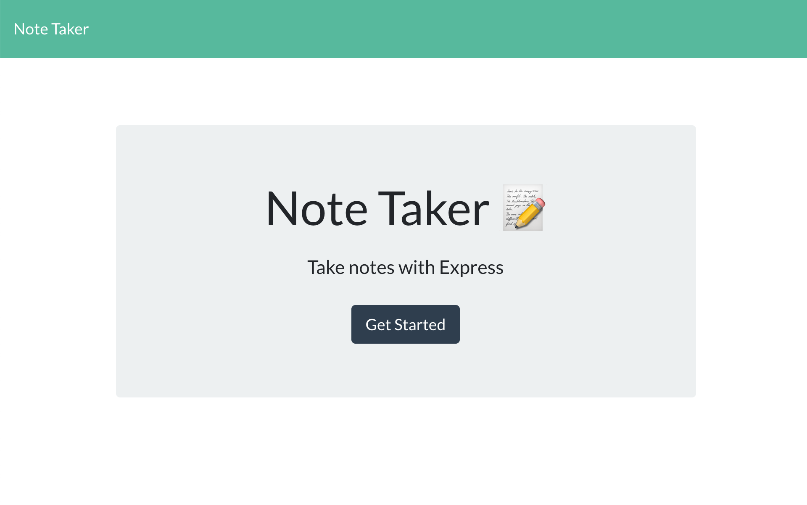
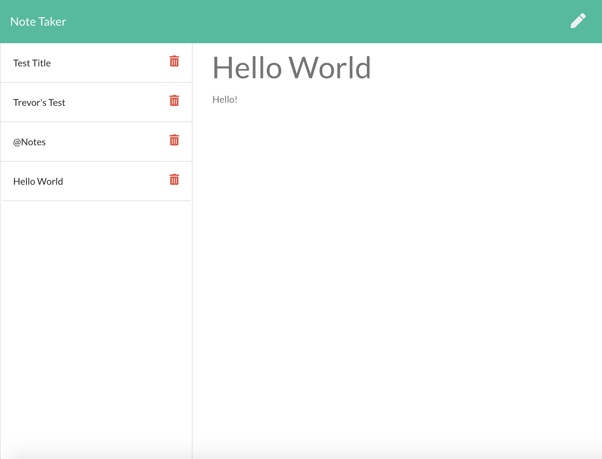

# Note Taker

## Description

This application uses an express backend and save and retrieve note data from a JSON file.

## Business Context

This application was created to help people organize information, creating and saving data into a database, and allowing the user to delete notes when needed easily.

Application allows users to create and save notes, view previously saved notes, and delete previously saved notes.

## Installation Instructions

```
npm init, npm i, npm i express, npm i json, npm i inquirer
```

### Screenshots of App

</img>
</img>

### Lessons Learned and Thanks

I learned a lot about creating servers, and using express with this application. I was able to effectively call a database using a db.json file for the first time, and I was able to effectively deploy my application on heroku. I was having a lot of trouble with pulling data for the application at first, but David Grant and others in my work group were able to help me fix all my errors.
